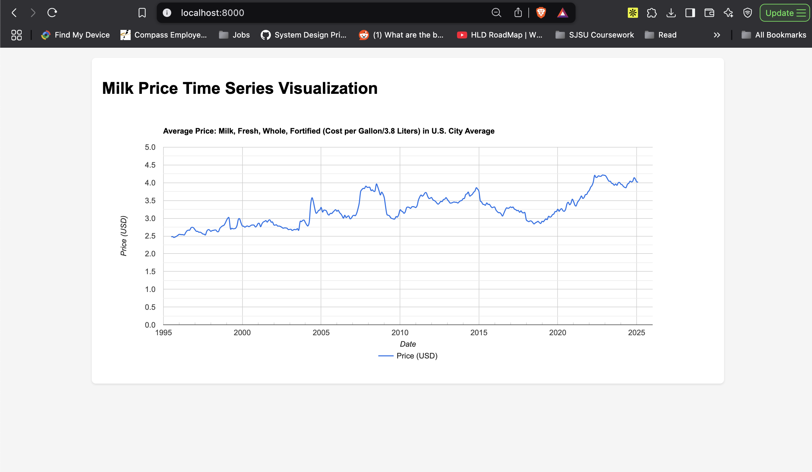

# Milk Price Visualization

This project visualizes the average price of milk (fresh, whole, fortified) per gallon in U.S. cities over time using Google Charts.

## Output



## Data Source

The data is sourced from the Federal Reserve Bank of St. Louis Economic Data (FRED):
- Series ID: APU0000709112
- Title: Average Price: Milk, Fresh, Whole, Fortified (Cost per Gallon/3.8 Liters) in U.S. City Average
- Source URL: https://fred.stlouisfed.org/series/APU0000709112

## Features

- Interactive line chart visualization
- Time series data from 1995 to present
- Price trends in USD per gallon
- Responsive design
- Smooth curve interpolation

## Setup

1. Clone the repository:
```bash
git clone [repository-url]
cd [repository-name]
```

2. Start a local server (using Python):
```bash
python3 -m http.server 8000
```

3. Open in your browser:
```
http://localhost:8000
```

## Project Structure

- `index.html` - Main HTML file with the visualization container
- `chart.js` - JavaScript code for data processing and chart rendering
- `APU0000709112.csv` - Data file containing milk price time series
- `.gitignore` - Git ignore patterns
- `README.md` - This documentation file
- `output.png` - Visualization output image

## License

This project is open source and available under the MIT License. 
